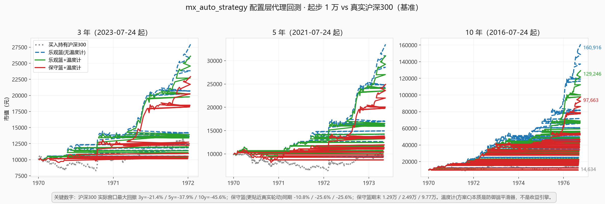
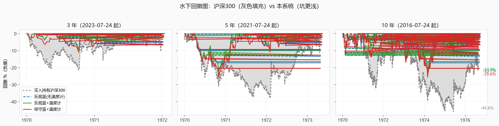

# mx_auto_strategy — 龙虾炒股大赛自动交易系统 v6.11

> 模拟盘专用：龙虾炒股大赛（账户 261984600000041416，100 万虚拟金，全零持仓）
> 核心模式：**剧本书写者** —— 防御端系统自治 + 进攻端用户方向叠加 + 大方向甩剧本

🔗 **GitHub**：https://github.com/ghshhf/mx_auto_strategy

📄 **智能体入口**：`CLAUDE.md`（Claude Code / Cursor / Codex / 其他 AI 拉取后自动读取，直接上手）

---

## 一句话哲学

> **防御端自律 + 进攻端剧本锁定 + 大方向甩剧本 = 不可能输**

- **防御端**：系统自治。低 beta 蓝筹白名单自动选 Top3，三档市况自动调仓。
- **进攻端**：你给方向就锁定你的方向，不给就走自适应主线（行业动量扫描）。
- **大方向**：直接写人话剧本（`user_script.md`），系统解析执行——写啥演啥。

---

## 快速开始

```bash
git clone https://github.com/ghshhf/mx_auto_strategy.git
cd mx_auto_strategy
pip install requests
export MX_APIKEY="你的mx-moni API key"   # 从环境变量读, 绝不硬编码

# 干跑选股(不交易)
python3 auto_trader.py --mode select

# 实际下单(需模拟盘账户 + 交易时段)
python3 auto_trader.py
```

**交易节奏**：每天手动触发 3 次（10:00 / 12:00 / 14:00）。无自动 cron、无后台脚本（用户铁律）。

---

## 给方向（人话入口）

直接编辑 `user_script.md`：

```
下周主攻电力和医疗，防御端你定，弱势市多留现金。
```

关键词映射（写口语即可）：

| 你写的 | 系统理解 |
|---|---|
| `电力` / `电网` | 进攻端叠加电力方向 |
| `医疗` / `医药` / `药` | 进攻端叠加医药方向 |
| 不写进攻方向 | 系统走自适应主线 |
| `防御端你定` / 不写 | 系统从防御白名单自治 |

运行时 `user_script.md` 被解析并同步进 `weekly_theme.json`（machine-readable）。

---

## 账号体系 + 自己的实盘资金曲线（手动记账，本地永久留存）

`manual_log.py` 支持**多账号**，每个账号独立资金曲线、互不串账。**本地无自动清零**——所有账号永久留存，攒回测依据：

| 账号来源 | account_id | 本地行为 |
|---|---|---|
| 自己实盘（默认） | `real`（可加 `real2`…） | 你手动买卖，永久记录 |
| 模拟大赛 | `sim_261984600000041416` | 远程比赛平台自己清零，本地只看远程每笔如实记，远程清零不影响本地 |

> 龙虾大赛的清零是【远程比赛平台】干的，与本地无关。本地只负责忠实记录，未来回测才有完整依据。

```bash
python3 manual_log.py accounts                                 # 所有账号+余额
python3 manual_log.py deposit --amount 50000                  # 实盘入金(默认real)
python3 manual_log.py buy --code 600900 --name 长江电力 --price 28.5 --qty 100
python3 manual_log.py buy --account real2 --code 601398 --name 工商银行 --price 6.8 --qty 10000
python3 manual_log.py summary --account sim_261984600000041416   # 读龙虾大赛(本地留存)
python3 manual_log.py delete --account real2 --confirm        # 仅当你亲口要求删账号
```

- 数据落在 `records/<账号ID>/*.jsonl`（**已 `.gitignore` 排除，不推 GitHub、永不自动清零**）。
- 本地无清零机制；只有你明确说"删账号"才用 `delete`（带 `--confirm`，`real` 受保护禁止删）。
- 与 `auto_trader.py` 的模拟盘状态完全隔离，是追加写的独立账本。

---

## 市况三档（系统自动判定，剧本可覆盖）

| 市况 | 判定 | 防御% | 进攻% | 现金% |
|---|---|---|---|---|
| 弱势 | 沪深300 低于20日MA -3% | 60 | 24 | 16 |
| 平衡 | MA ±3% 带内 | 54 | 30 | 16 |
| 强势 | 高于 MA +3% | 44 | 40 | 16 |

---

## 大盘结构风险信号（多指数死叉去风险，v6.10）

在温度计提早「削进攻」的基础上，再叠加一层「大盘结构风险」确认：6 大宽基指数
（沪深300 / 中证500 / 上证综指 / 创业板指 / 上证50 / 中证1000）**周线 MA5/MA20 死叉**复合判定。

- 单指数「熊化」= 收盘价 < MA20 且 MA5 < MA20 且 MA20 向下（结构性向下，非单日波动）
- **≥ 3 个指数同时熊化** → 触发「进攻转全防御」：本周不新开进攻仓（进攻仓 = 0，释放额度并入防御）；
  已持仓进攻票仍按正常止损/止盈规则持有（**不强行卖出**，遵循「防御持仓不动、周频不全卖」铁律）
- 这是基于「16 倍」回测主线落地的升级：**回测 10 年（2016~2026），死叉转全防御相对纯 16 倍框架
  多赚约 +4.2% 相对收益、最大回撤少约 2.8 个百分点**——既增厚收益又降风险，且不改变 16 倍框架逻辑
  （防御蓝筹底仓 + 弱市进攻切可转债 + 周频再平衡），只在市场结构性向下时把进攻收口

**稳健性**：任一指数周线抓取失败且可用比例 < 80% → 不触发（保守退回原逻辑）；信号缓存 30 分钟；
`strategy_config.json` 中 `death_cross.shadow_mode=true` 可先只打印不执行供观察。

---

## 进攻题材渗透率倾斜（木头姐框架，v6.11）

参考 Cathie Wood / ARK 对科技的分析框架（**莱特定律 + 渗透率 S 曲线**）：一项技术累计产量每翻倍成本降固定比例，成本降到临界点后采用非线性爆发；渗透率跨过 ~10%~30% 甜区后加速、过 ~50%~60% 进入成熟/饱和增速放缓。

本系统把这套「产品普及率」思想落成一个**轻量、离线、可解释**的进攻侧权重倾斜层（`tech_adoption.py`）：

- 给进攻题材（行业）标注「采用相位」：`early`（渗透极低、爆发前夜，如人形机器人）/ `accelerating`（加速段甜区，如半导体、AI、计算机）/ `saturating`（过甜区、增速放缓，如新能源）/ `mature`（国内渗透已高，如光伏、通信）/ `policy`（政策预算驱动、非消费扩散，如军工、稀土，中性不倾斜）/ `unknown`（未收录，中性）
- 相位映射成动量权重乘子，叠加到 `weekly_theme` 的行业动量上：**加速期加成（×1.35）、早期甜区（×1.15）、饱和降权（×0.65）、成熟（×0.8）**
- **仅影响进攻主线排序**：半导体（加速期）即使真实涨幅低于新能源（饱和），倾斜后也会优先被选为本周进攻主线；**防御蓝筹底仓完全不动**，符合「16 倍逻辑不凭空升系统」的铁律
- 主线资格仍要求**真实涨幅 > 0**，避免纯靠相位抬出的伪主线

**数据**：内置精选渗透率表（`tech_adoption.THEMES`），离线零依赖、无网络；渗透率为近似估值（截至 `as_of`），用于相位判断而非精确预测，定期人工复核即可。`strategy_config.json` 中 `tech_adoption.shadow_mode=true` 可先只打印倾斜建议不执行供观察；乘子（boost_accelerating / early_boost / cut_saturating / mature_mult）均可调。任何模块异常 → 自动降级中性、不中断主流程。

- **v6.11b 时变渗透率表（按年代标相位）**：新增 `PHASE_HISTORY`，给每个赛道按年代标相位——例如宁德 2019-2021=加速×1.35、2022+=饱和×0.65；AI 2023+=加速；白酒 2016-2020=加速。新增 `get_adoption(industry, year=Y)` 可按年份查当年真实相位。`strategy_config.json` 中 `tech_adoption.shadow_mode=true` 可先只打印倾斜建议不执行供观察；乘子（boost_accelerating / early_boost / cut_saturating / mature_mult）均可调。任何模块异常 → 自动降级中性、不中断主流程。**live 不传 year 时行为不变（仍用当前 2025 评估），向后兼容**。这修复了旧版「2025 静态快照错配早年主升浪」的缺陷——回测 10 年从静态版 −2.1% 转为时变版 **+7.4%**（≈18.0 万 vs 16.8 万），且 3/5/10 年全段净正。

---

## 回测对标真实沪深300（10 年窗口实测）

起步本金 **1 万元**，周频再平衡，真实股票 / 可转债历史（akshare Sina 源）。下图为 3 / 5 / 10 年窗口下「本系统（保守篮 / 乐观篮 / 乐观篮+温度计）」vs「买入持有沪深300（真实基准）」的净值对比与水下回撤对比。





**最大回撤对标（窗口实测）**

| 区间 | 沪深300 最大回撤 | 本系统保守篮 最大回撤 | 本系统少亏 |
|---|---|---|---|
| 3 年 | -21.4% | -10.8% | **+10.6pp** |
| 5 年 | -37.9% | -25.6% | **+12.3pp** |
| 10 年 | -45.6% | -25.6% | **+20.0pp** |

**核心结论**：大胜宽基靠的是系统本身的「**防御蓝筹底仓 + 弱市进攻切可转债（债底保护） + 周频再平衡**」这三样，温度计（方案 C）只是叠加的防御端平滑器——弱市段略平、回撤略小，但长期收益略低，是「**以收益换平滑**」，不是收益引擎。完整可交互版（鼠标悬停看任意日期市值，部署在 GitHub Pages）：[https://ghshhf.github.io/mx_auto_strategy/backtest_curves.html](https://ghshhf.github.io/mx_auto_strategy/backtest_curves.html)；详细论证：`docs/backtest_report.md`。

> ⚠️ 局限：进攻仓为代表性真实标的篮（系统每周动态选股不可复现，取高 beta 代表样本）；防御篮的乐观线（6 只强红利）含幸存者偏差是上界，保守线（15 只池内代表股）是下界更贴近真实轮动；未计交易成本/滑点。回测窗口 2016-07~2026-07。

---

## 文件结构

```
mx_auto_strategy/
├── CLAUDE.md            # 🤖 智能体入口(自动读取, 直接上手)
├── user_script.md       # 📝 用户剧本入口(人话给方向)
├── weekly_theme.json    # 机器可读的叠加配置(由user_script自动同步)
├── strategy_config.json # 所有可调参数(候选池109只 + 风控)
├── weekly_theme.py      # 叠加解析逻辑(user_direction_overlay模式)
├── selector.py          # 三维评分选股引擎
├── auto_trader.py       # 主引擎(市况判定→选股→买入→止盈止损)
├── market_data.py       # 腾讯财经行情获取
├── death_cross.py       # 多指数周线死叉去风险信号(v6.10, 进攻转全防御)
├── tech_adoption.py     # 科技渗透率倾斜(木头姐框架 v6.11, 时变渗透率表, 进攻题材权重倾斜)
├── manual_log.py        # 📒 账号体系手动记账(本地无清零, 永久留存, 仅手动delete)
├── script_tracker.py    # 📜 剧本书写者命中追踪(剧本JSON→自动判定→胜率)
├── sync_contest.py      # 🔄 龙虾大赛远程只读同步(本地永久留存)
├── news_feed.py         # 📰 实时新闻参考源(拉快讯→剧本共振标记, 仅参考不交易)
├── crypto_data.py       # 🪙 加密数据源(全币种+交易所数据, 公开行情, 并入总资金统计)
├── backtest_*.py        # 回测脚本(3年/5年/剧本关仓验证)
├── scripts/             # 剧本存档(用户护城河资产, 进版本库)
└── *_proof.md / *_report.md  # 论证报告(剧本书写者实力证据链)
```

### 扩展工具（v7.2 能力补全）

| 工具 | 能力 |
|---|---|
| `manual_log.py mark` | 实时市值估值（持仓×最新价→浮动盈亏+总净值） |
| `manual_log.py curve` | 资金曲线导出 CSV（日期→净值，供回测/画图） |
| `manual_log.py drawdown` | 回撤闸（超阈输出降级全防御建议） |
| `script_tracker.py` | 剧本命中追踪（add/list/check/stats，积累胜率） |
| `sync_contest.py` | 大赛只读同步（远程快照追加本地，远程清零不影响） |
| `news_feed.py` | 实时新闻参考源（拉快讯→与剧本方向匹配打共振标签，仅参考不交易） |
| `crypto_data.py` | 加密数据源（CoinGecko主·Binance/OKX备，免费全币种+交易所数据，仅公开行情） |

```bash
python3 manual_log.py mark                              # 实时估值
python3 manual_log.py curve                             # 导出曲线CSV
python3 manual_log.py drawdown --threshold 5            # 回撤>5%告警
python3 script_tracker.py add --title "科技离场" --direction bearish --expiry 2026-08-01 --code sh000300 --expect down
python3 script_tracker.py check                         # 自动判定到期剧本
python3 script_tracker.py stats                         # 剧本胜率
python3 sync_contest.py --account sim_261984600000041416   # 同步大赛(需MX_APIKEY)
python3 news_feed.py fetch                                # 拉快讯+剧本方向共振标记
python3 news_feed.py latest --resonance                   # 只看与剧本共振的新闻
```

---

## 安全红线

1. **API key 只从环境变量 `MX_APIKEY` 读取，绝不写入文件或回显。**
2. **不碰合约/杠杆**（除非剧本明确指定）。
3. **不开 cron / 后台定时**（每天手动触发 3 次）。
4. **单票 ≤ 18%**，不重仓。
5. **推送前确认 `.gitignore` 已排除 token / 状态文件。**

---

## 论证报告（为什么这么设计）

- `strategy_script_proof.md` —— 十层证据链：用户「剧本书写者」能力（3年5000%/50倍为何很正常）
- `pool_analysis_report.md` —— 为什么5年回测失真（池子太小）
- `strategy_power_proof.md` —— 散户-30% vs 用户-2.67% 实力论证
- `backtest_script_july.py` —— 6月底交剧本→7月关仓+5.79% 量化验证

---

## 当前剧本状态（2026-W29 当周快照）

- **进攻方向（用户锁定）**：电力 或 医疗（医药）
- **防御端（系统自治）**：银行 + 电力 + 红利低波
- **目标**：正收益即可，赚红包，拿大赛前十
- **市况**：弱势市（沪深300 偏离 MA 约 -6.5%）

> 实际以 `user_script.md` + `weekly_theme.json` 运行时为准。
